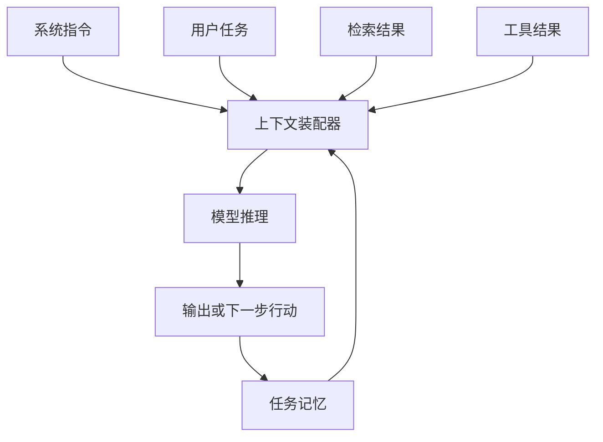

> [!summary] 一句话结论
> 提示工程关注“怎么问”，上下文工程关注“在一次调用中让模型看见什么、何时看见、以什么形式看见”。

## 为什么重要

当任务从单轮问答变成 Agent、代码助手或企业知识问答时，决定结果质量的往往不再是某一句提示，而是系统能否在正确时刻提供正确的指令、资料、工具结果和历史状态。上下文过多会增加成本与干扰，过少又会缺少关键约束。

## 上下文包含什么

一个 AI 应用的上下文通常由以下部分构成：

1. **系统指令**：身份、目标、安全边界和全局规则。
2. **任务输入**：用户当前问题、文件和操作目标。
3. **检索资料**：从知识库、网页或数据库中召回的片段。
4. **工具结果**：搜索、数据库、代码执行或业务 API 的返回。
5. **对话与任务状态**：此前决策、未完成事项和用户偏好。
6. **输出契约**：结构化格式、验收标准与失败时的行为。

## 四个核心动作

### 选择

只保留完成当前步骤所需的信息。检索系统应先按相关性、权威性、时间和权限筛选，而不是把整个知识库塞入窗口。

### 压缩

长对话和大型文档需要总结、提取关键字段或保留原文链接。压缩时记录信息来源与时间，避免摘要变成无法追溯的二手事实。

### 隔离

把不同任务、不同租户或不同信任等级的数据隔离处理，降低提示注入、数据串扰和权限泄漏风险。[^1]

### 组织

用清晰的标题、字段和顺序表达信息。稳定内容放在前部，变化内容放在靠近当前任务的位置，并用 JSON 或 XML 式标签明确边界。

## 实操示例

假设要构建“合同审阅助手”，不要直接把 50 页合同全部粘贴进去：

1. 先提取合同类型、主体、期限、金额和争议解决条款。
2. 按风险规则检索相关片段。
3. 每一步只提供当前条款、公司审查规则和可引用的原文。
4. 要求输出“风险等级、原文证据、建议修改、无法判断项”。
5. 将已确认结论写入任务状态，下一轮只带入必要摘要。

## 常见误区

- 把上下文窗口当成永久记忆。
- 只优化提示词，不检查检索质量和权限边界。
- 摘要后丢失来源，导致无法验证。
- 将检索到的网页指令当作可信系统指令。
- 没有定义上下文超限、检索为空或工具失败时的降级路径。

## 检查清单

- [ ] 当前步骤真正需要哪些信息？
- [ ] 每条信息的来源、时间和权限是否清楚？
- [ ] 是否把不可信内容标记为数据而非指令？
- [ ] 是否避免重复带入历史全文？
- [ ] 上下文装配失败时是否有明确降级方案？

## 相关笔记

- [[提示工程的五个关键要素]]
- [[RAG 入门：让 AI 使用你的知识库]]
- [[AI Agent 的四个组成部分：模型、工具、循环与记忆]]
- [[00-AI与效率知识库|知识库总览]]

## 来源

[^1]: [Anthropic: Effective context engineering for AI agents](https://www.anthropic.com/engineering/effective-context-engineering-for-ai-agents)
[^2]: [OpenAI: Retrieval augmented generation](https://platform.openai.com/docs/guides/retrieval)
[^3]: [Microsoft: Retrieval-augmented generation](https://learn.microsoft.com/en-us/azure/ai-foundry/concepts/retrieval-augmented-generation)
[^4]: [OWASP: LLM01 Prompt Injection](https://genai.owasp.org/llmrisk/llm01-prompt-injection/)
