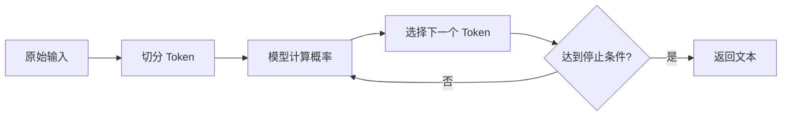

> [!summary] 一句话结论
> 大语言模型不是数据库，也不是在“理解”后查答案；它把输入拆成 Token，根据训练中形成的概率分布逐步预测下一个 Token。

## 为什么重要

理解生成机制，可以帮助你判断模型什么时候可靠、为什么会产生幻觉，以及为什么“把资料全部贴进去”并不一定得到更好答案。它也会改变你使用模型的方式：重点不再是寻找一句神奇提示词，而是提供清晰目标、合适上下文和可验证的输出。

## 核心概念

### 1. 文本先变成 Token

模型不能直接处理自然语言，而是先把文本切成 Token。Token 可能是单词、词的一部分、汉字或标点。不同模型的切分方式不同，因此同一个句子的 Token 数量也会变化。[^1]

Token 数量直接影响两件事：调用成本和可放入上下文的信息量。中文、代码、JSON 与长链接的 Token 密度往往不同，不能简单按“字符数”估算。

### 2. 生成是逐步预测

常见的自回归语言模型会根据已有 Token，计算下一个 Token 的概率，再从中选择结果并把它加入输入，继续预测下一步。[^2]

所以，同一问题不保证每次得到完全相同的答案。温度、采样策略、上下文内容和模型版本都会影响输出。

### 3. 上下文窗口是工作区，不是长期记忆

上下文窗口是模型单次调用中能看见的 Token 上限，通常包含系统指令、用户问题、对话历史、检索资料和工具返回结果。超过窗口的内容必须截断、摘要或通过外部检索补充。[^3]

上下文窗口变大并不代表模型会自动关注所有细节。信息越多，噪声和相互冲突也可能越多。更可靠的做法是只放入完成当前任务所需的高价值信息。

## 实操方法

1. 先写清楚任务目标、受众和成功标准。
2. 只提供必要背景，并标注哪些内容是事实、哪些是假设。
3. 对长文档先分块、建索引，需要时再检索相关片段。
4. 对关键结论要求给出来源、计算过程或反例。
5. 对高风险结果使用外部工具或人工复核，而不是只相信语言流畅度。

## 常见误区

- **“模型知道所有新信息”**：模型参数不会自动更新，联网检索和手动提供资料才可能引入新信息。
- **“上下文越长越好”**：无关内容会增加成本与干扰。
- **“回答流畅就代表正确”**：流畅只是概率生成的结果，不是事实保证。
- **“模型会记住上次对话”**：除非应用显式保存历史或使用外部记忆，否则会话之间通常不共享状态。

## 检查清单

- [ ] 我是否说明了任务、受众和输出格式？
- [ ] 关键资料是否放在模型中可访问的位置？
- [ ] 我是否区分了事实、推断和建议？
- [ ] 高风险结论是否有外部来源或人工复核？
- [ ] 是否理解 Token、成本和上下文长度之间的关系？

## 相关笔记

- [[提示工程的五个关键要素]]
- [[从提示工程到上下文工程]]
- [[降低 AI 幻觉：验证、引用与不确定性]]
- [[00-AI与效率知识库|知识库总览]]

## 来源

[^1]: [Hugging Face LLM Course: Tokenizers](https://huggingface.co/learn/llm-course/chapter2/4)
[^2]: [Attention Is All You Need](https://arxiv.org/abs/1706.03762)
[^3]: [Anthropic: Effective context engineering for AI agents](https://www.anthropic.com/engineering/effective-context-engineering-for-ai-agents)
[^4]: [OpenAI Help: How ChatGPT and our language models are developed](https://platform.openai.com/docs/guides/text-generation)
