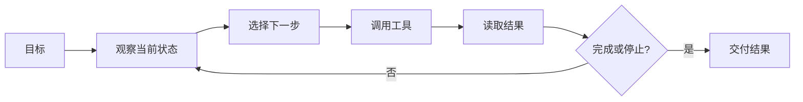

> [!summary] 一句话结论
> Agent 不是“更会聊天的模型”，而是让模型在工具、循环和记忆的约束下，围绕目标持续观察、行动和验证。

## 为什么重要

普通聊天通常是一问一答，Agent 则可能读取文件、调用搜索、执行代码、提交订单或修改数据库。能力扩大后，错误也会从“答错一句话”变成“执行了错误操作”。理解 Agent 的基本结构，才能判断何时值得使用，以及如何设置权限和停止条件。

## 四个组成部分

### 1. 模型：决策与语言理解

模型负责理解目标、选择下一步动作、生成工具参数，并根据工具结果调整计划。复杂任务通常需要更强推理能力，但简单流程可以拆给更小、更便宜的模型。

### 2. 工具：接触外部世界

工具可以是搜索、文件系统、浏览器、数据库、代码执行器或业务 API。工具描述必须清楚说明用途、输入格式、权限、失败返回和是否具有副作用。[^1]

### 3. 循环：观察、思考、行动

Agent 会重复“观察状态 → 选择动作 → 执行工具 → 读取结果 → 更新计划”的过程。[^2]

循环必须有最大步数、超时、预算和人工暂停点，防止无限重试或成本失控。

### 4. 记忆：跨步骤保留状态

短期记忆记录当前任务结果，长期记忆保存用户偏好、历史和可复用经验。记忆必须可删除、可纠错、可追溯，否则会长期放大错误。

## 从简单到复杂

Anthropic 建议优先从最简单的工作流开始：如果固定步骤能解决问题，就不必使用开放式 Agent。只有在路径无法预先确定时，才让模型动态选择工具和步骤。[^1]

常见形态包括：

- 工作流：步骤由代码预定义，模型只完成局部任务。
- 单 Agent：模型动态选择工具并循环执行。
- 多 Agent：多个角色分工，但协调成本和失败模式会显著增加。

## 实操设计顺序

1. 写清楚目标与完成定义。
2. 列出允许使用的工具和禁止动作。
3. 为每个工具设置最小权限。
4. 定义循环上限、超时和成本预算。
5. 对写操作增加预览、确认或回滚机制。
6. 记录每一步输入、输出和工具版本。

## 常见误区

- 为了“先进”而把简单流程做成 Agent。
- 给 Agent 全权限，只依赖提示词约束。
- 没有完成条件，模型只能不断尝试。
- 工具返回错误格式，导致循环失控。
- 把记忆当成绝对事实，没有过期和纠错机制。

## 检查清单

- [ ] 目标是否可以被验证？
- [ ] 工具权限是否最小化？
- [ ] 是否限制步数、时间和费用？
- [ ] 写操作是否有人工确认或回滚？
- [ ] 每一步是否可追踪和复现？

## 相关笔记

- [[工具调用与函数调用：从回答到执行]]
- [[从提示工程到上下文工程]]
- [[AI 自动化工作流：从触发器到人工审核]]
- [[00-AI与效率知识库|知识库总览]]

## 来源

[^1]: [Anthropic: Building effective agents](https://www.anthropic.com/research/building-effective-agents)
[^2]: [ReAct: Synergizing Reasoning and Acting in Language Models](https://arxiv.org/abs/2210.03629)
[^3]: [OpenAI: Agents guide](https://platform.openai.com/docs/guides/agents)
[^4]: [LangGraph: Concepts](https://docs.langchain.com/oss/python/langgraph/overview)
