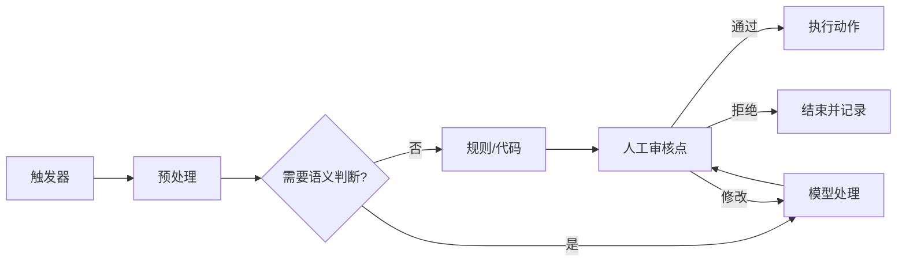

> [!summary] 一句话结论
> 可靠自动化不是让 AI 接管全部流程，而是把固定规则交给代码，把不确定判断交给模型，并在高风险节点保留人工审核。

## 为什么重要

许多重复工作包含稳定步骤，也包含需要理解语义的环节。例如接收邮件、提取需求、查询客户、生成草稿、等待审批、发送回复。把整个流程都写成硬编码规则会脆弱，把全部步骤都交给模型又难以保证稳定。

## 推荐架构

- **触发器**：新邮件、表单提交、文件变化、定时任务或 Webhook。
- **预处理**：去重、权限检查、字段规范化和敏感信息处理。
- **模型节点**：分类、摘要、抽取、生成草稿或选择工具。
- **规则节点**：金额、日期、权限和格式校验。
- **人工审核**：发布、付款、删除、外发等高风险动作。
- **执行节点**：调用业务 API、写入数据库或发送通知。

## 一个邮件处理案例

1. 新邮件触发工作流。
2. 过滤垃圾邮件并识别客户编号。
3. 用模型分类为咨询、投诉、退款或合作。
4. 查询订单系统，验证客户和历史记录。
5. 生成回复草稿，但不直接发送。
6. 客服审核并修改后发送。
7. 保存原邮件、模型输出、审批人和最终结果。

n8n 等自动化平台已经提供 AI 节点、工具调用和工作流编排能力，但平台不会自动解决权限与质量问题。[^1]

## 设计原则

- 每个节点只负责一个清晰任务。
- 使用结构化数据在节点之间传递，而不是长段自然语言。
- 为每个外部调用设置超时、重试和幂等键。
- 保存输入、输出版本，方便复现问题。
- 模型只能建议高风险动作，不能直接执行。

## 人工审核的三个层级

1. **发送前审核**：模型只生成草稿，人确认后才外发，适合客服、营销和重要沟通。
2. **抽样审核**：低风险任务自动执行，按比例抽检并保留申诉入口，适合分类、标签和内部通知。
3. **异常升级**：正常任务自动完成，只有低置信度、金额超限或规则冲突时转人工，适合规模较大的后台流程。

自动化上线后还要监控业务指标，而不只是技术成功率。例如邮件处理需要跟踪误分类率、重复发送率、人工修改比例和平均处理时长。成本监控应同时覆盖模型 Token、工具调用、存储和人工审核时间。出现连续失败时应自动暂停任务，保留输入与中间结果，避免错误持续扩散。

## 常见误区

- 一开始就做全自动闭环。
- 用模型判断本可稳定用代码处理的规则。
- 没有失败队列，异常任务直接丢失。
- 自动重试有副作用的操作，造成重复发送。
- 只监控“是否运行成功”，不监控业务结果。

## 检查清单

- [ ] 触发器是否唯一且可追踪？
- [ ] 模型节点输出是否结构化？
- [ ] 高风险步骤是否需要审批？
- [ ] 失败任务是否有重试和人工处理入口？
- [ ] 是否记录成本、延迟和成功率？

## 相关笔记

- [[AI Agent 的四个组成部分：模型、工具、循环与记忆]]
- [[工具调用与函数调用：从回答到执行]]
- [[AI 隐私与数据边界：哪些内容不要上传]]
- [[00-AI与效率知识库|知识库总览]]

## 来源

[^1]: [n8n: Advanced AI](https://docs.n8n.io/advanced-ai/)
[^2]: [Zapier: Use AI in Zaps](https://zapier.com/ai)
[^3]: [OpenAI: Structured outputs](https://platform.openai.com/docs/guides/structured-outputs)
[^4]: [Microsoft Power Automate documentation](https://learn.microsoft.com/en-us/power-automate/)
