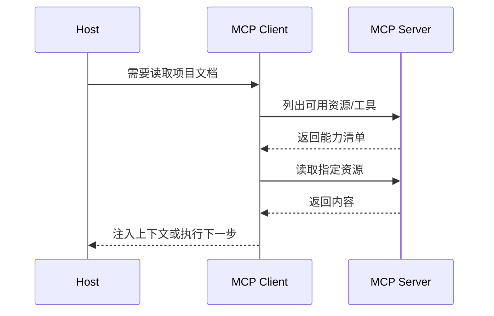

> [!summary] 一句话结论
> MCP 是模型应用与外部数据、工具之间的开放协议，目标是减少“每接一个工具就写一套定制适配器”的重复工作。

## 为什么重要

AI 应用需要连接文件、数据库、代码仓库、搜索和业务系统。如果每个客户端都自己定义工具格式，供应商和开发者会被大量适配工作拖累。MCP 通过统一的消息与能力协商方式，让客户端、服务器和模型应用之间形成更可复用的连接层。[^1]

## 三个核心角色

| 角色 | 职责 | 示例 |
| --- | --- | --- |
| Host | 面向用户的 AI 应用 | IDE、聊天客户端、桌面助手 |
| Client | Host 内的协议连接器 | 连接一个或多个 MCP Server |
| Server | 暴露资源和工具 | 文件系统、GitHub、数据库、搜索服务 |

MCP Server 可以暴露三类主要能力：

- **Resources**：可读取的数据，如文件、记录、文档。
- **Tools**：可执行动作，如搜索、查询、提交变更。
- **Prompts**：可复用的任务模板。

## 一次典型交互

协议解决的是“如何连接”，并不自动解决权限、质量和安全。服务器仍需要身份认证、最小权限、审计和输入校验。

## 落地步骤

1. 明确要连接的数据源和允许执行的动作。
2. 优先选择官方或维护活跃的 Server。
3. 在隔离环境测试 Server 的文件和网络权限。
4. 对敏感数据使用只读资源，写工具要求人工确认。
5. 记录工具调用日志、版本和错误。
6. 为不可信返回内容设置隔离边界，防止提示注入。

## 服务器与传输方式

本地 Server 常通过标准输入输出与客户端通信，适合访问当前机器上的文件和开发工具；远程 Server 通常通过网络协议连接，适合共享组织服务。无论采用哪种方式，都应明确身份认证、传输加密、租户隔离和网络访问范围。

选择 Server 时先看三个问题：是否由可信维护者发布、是否固定版本并记录变更、是否支持最小权限和审计。对于只读资料优先使用 Resource；只有确实需要改变外部状态时才开放 Tool。连接多个 Server 时还要控制工具数量，并处理同名工具和能力冲突。

## 常见误区

- 认为使用 MCP 就自动安全。
- 安装来源不明的 Server 并授予完整系统权限。
- 把资源内容和系统指令混在一起。
- 工具数量过多，模型难以选择。
- 没有处理连接断开、超时和版本不兼容。

## 检查清单

- [ ] Server 是否来自可信来源并固定版本？
- [ ] 是否只开放完成任务所需的最小权限？
- [ ] 写操作是否有人工确认？
- [ ] 返回内容是否被视为不可信数据？
- [ ] 是否有日志、限流和故障降级？

## 相关笔记

- [[工具调用与函数调用：从回答到执行]]
- [[AI Agent 的四个组成部分：模型、工具、循环与记忆]]
- [[Prompt Injection：AI 应用常见安全风险]]
- [[00-AI与效率知识库|知识库总览]]

## 来源

[^1]: [Model Context Protocol: Introduction](https://modelcontextprotocol.io/docs/getting-started/intro)
[^2]: [Model Context Protocol specification](https://modelcontextprotocol.io/specification/2025-06-18)
[^3]: [MCP GitHub repository](https://github.com/modelcontextprotocol/modelcontextprotocol)
[^4]: [Anthropic: Introducing the Model Context Protocol](https://www.anthropic.com/news/model-context-protocol)
