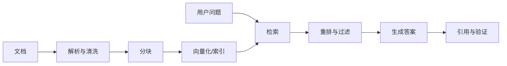

> [!summary] 一句话结论
> RAG 先检索相关资料，再让模型基于资料回答；系统质量取决于数据治理、切分、检索、重排和评测，而不只是换一个更强的模型。

## 为什么重要

模型参数中的知识可能过时、无法覆盖企业私有内容，也无法证明答案来自哪里。RAG 把外部知识库接入生成过程，让回答可以引用最新文档、内部规章或项目资料。[^1]

## 标准流程

## 五个关键环节

### 文档治理

先确认哪些文档可信、谁有权限、多久更新一次。旧版本、重复内容和无权限资料进入索引，会直接污染回答。

### 分块

按标题、段落和语义边界切分，通常比机械按固定字符数更合理。每块保留文档标题、章节、版本、权限和稳定 ID。

### 检索

关键词检索擅长精确术语，向量检索擅长语义相似，混合检索通常更稳健。按时间、部门、权限和版本进行过滤同样重要。

### 重排

初步召回 20–50 条，再用重排模型选出最相关的 3–8 条。减少噪声比增加上下文长度更有效。

### 生成与验证

提示模型只依据检索内容回答，逐条引用来源。若资料不足，明确说“知识库中没有足够信息”。[^2]

## 最小可行实现

1. 选择 20–100 篇高质量文档。
2. 保留来源、版本和权限元数据。
3. 使用混合检索召回候选片段。
4. 让模型按固定格式输出答案和引用。
5. 建立至少 30 条问答评测集。
6. 记录失败类型并持续更新索引。

## 如何评估 RAG

RAG 需要分别评估检索和生成，不能只看最终回答是否顺眼。

| 指标 | 说明 | 典型检查 |
| --- | --- | --- |
| Recall@K | 前 K 条结果是否包含正确资料 | 正确片段是否被召回 |
| Precision@K | 召回结果中有多少真正相关 | 是否混入大量噪声 |
| Answer Faithfulness | 答案是否忠于检索内容 | 是否加入资料外事实 |
| Answer Relevance | 答案是否直接回应用户 | 是否答非所问 |
| Citation Accuracy | 引用是否支持对应结论 | 链接与原文是否一致 |

测试集应覆盖同义表达、缩写、时间版本、无答案问题和权限隔离场景。每次更换切分方式、嵌入模型或重排模型，都应重新运行同一套测试，否则无法判断改动是否真正有效。

## 常见误区

- 把所有文件直接向量化，不清理重复和过期版本。
- 只调整生成提示，不检查检索召回率。
- 引用只显示文档名，无法定位具体段落。
- 忽略权限过滤，导致越权信息进入回答。
- 没有评测集，只能凭几次聊天判断好坏。

## 检查清单

- [ ] 文档来源、版本和权限是否明确？
- [ ] 分块是否保留上下文和来源 ID？
- [ ] 是否采用混合检索和重排？
- [ ] 无答案时是否拒答？
- [ ] 是否持续测量召回率和答案正确率？

## 相关笔记

- [[从提示工程到上下文工程]]
- [[降低 AI 幻觉：验证、引用与不确定性]]
- [[AI Agent 的四个组成部分：模型、工具、循环与记忆]]
- [[00-AI与效率知识库|知识库总览]]

## 来源

[^1]: [Retrieval-Augmented Generation for Knowledge-Intensive NLP Tasks](https://arxiv.org/abs/2005.11401)
[^2]: [Microsoft: Retrieval-augmented generation](https://learn.microsoft.com/en-us/azure/ai-foundry/concepts/retrieval-augmented-generation)
[^3]: [LangChain: RAG concepts](https://python.langchain.com/docs/concepts/rag/)
[^4]: [OpenAI: Retrieval guide](https://platform.openai.com/docs/guides/retrieval)
