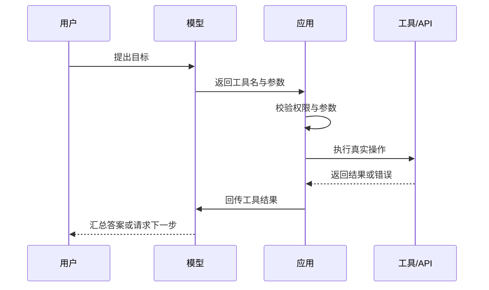

> [!summary] 一句话结论
> 工具调用让模型生成结构化请求，真正执行动作的仍是你的程序，因此权限、校验和错误处理必须由外部系统负责。

## 为什么重要

模型本身只能生成文本。要查询天气、读取订单、发送邮件或修改代码，应用必须提供一个明确的工具接口。工具调用把自然语言意图转换为结构化参数，从而连接模型与真实业务系统。

## 工作流程



关键点是：模型选择工具，但应用决定是否允许执行。[^1]

## 工具设计原则

### 名称与描述要具体

不要只写“数据库工具”。更好的描述是“按订单号查询订单状态；只读；返回状态、金额和更新时间”。清楚的描述能减少误选参数。

### 参数使用严格 Schema

用 JSON Schema 定义必填字段、类型、枚举和范围。例如退款原因只能从固定列表中选择，金额必须大于 0 且小于订单金额。

### 区分只读和写入

- 只读工具：查询、搜索、读取文件。
- 低风险写入：创建草稿、添加标签。
- 高风险写入：转账、删除、发布、发送邮件。

高风险工具应要求二次确认、审批或沙箱执行。[^2]

### 返回结构化结果

工具返回应包含 `success`、`data`、`error_code` 和可读错误信息。不要把一整段日志直接塞回模型，以免浪费上下文并隐藏关键错误。

## 示例

```json
{
  "name": "search_orders",
  "description": "按用户 ID 和日期范围查询订单",
  "parameters": {
    "type": "object",
    "properties": {
      "user_id": {"type": "string"},
      "start_date": {"type": "string", "format": "date"},
      "end_date": {"type": "string", "format": "date"}
    },
    "required": ["user_id", "start_date", "end_date"]
  }
}
```

## 生产环境注意事项

- **幂等键**：每次写操作携带唯一请求 ID，服务端发现重复请求时返回第一次结果，避免自动重试造成重复扣款或重复发送。
- **错误分类**：网络超时、参数错误、权限不足和业务规则冲突需要不同处理。参数错误应立即返回模型修正，权限不足应直接拒绝。
- **超时与预算**：为单次工具调用和整个任务同时设置上限，防止一个外部接口拖住全部流程。
- **敏感日志**：记录工具名、参数摘要、结果状态和耗时，但不要在日志中保存完整密钥或隐私数据。
- **版本兼容**：工具 Schema 变化时，应保留旧版本并灰度迁移，避免模型突然生成不兼容参数。

## 常见误区

- 把模型返回的参数直接传给高权限 API。
- 工具描述含糊，导致模型选择错误工具。
- 只处理成功路径，没有超时、重试和幂等设计。
- 对写操作自动重试，造成重复扣款或重复发送。
- 把工具返回的网页内容当成系统指令，触发提示注入。

## 检查清单

- [ ] 每个工具是否有清晰描述和参数 Schema？
- [ ] 是否进行了服务端权限校验？
- [ ] 写操作是否幂等并支持回滚？
- [ ] 工具错误是否可被模型理解？
- [ ] 是否限制调用次数和总成本？

## 相关笔记

- [[AI Agent 的四个组成部分：模型、工具、循环与记忆]]
- [[MCP 入门：连接模型与外部工具]]
- [[Prompt Injection：AI 应用常见安全风险]]
- [[00-AI与效率知识库|知识库总览]]

## 来源

[^1]: [OpenAI: Function calling](https://platform.openai.com/docs/guides/function-calling)
[^2]: [Anthropic: Tool use overview](https://docs.anthropic.com/en/docs/agents-and-tools/tool-use/overview)
[^3]: [Toolformer: Language Models Can Teach Themselves to Use Tools](https://arxiv.org/abs/2302.04761)
[^4]: [OpenAI: Structured outputs](https://platform.openai.com/docs/guides/structured-outputs)
