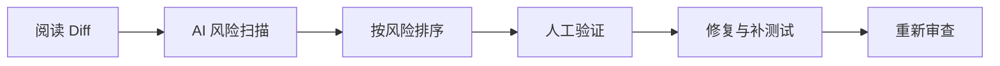

> [!summary] 一句话结论
> AI 很适合做第一轮缺陷扫描，但不能替代代码作者对业务语义、安全边界和最终结果负责。

## 为什么重要

AI 代码审查可以快速发现空值、越界、异常处理、日志泄漏和测试缺口，但它也可能误报，或者因为看不到完整业务背景而漏掉关键问题。最好的方式是让 AI 聚焦具体风险，再由人处理优先级和领域判断。

## 审查哪些内容

- 行为是否符合需求和验收标准；
- 是否改变现有公开接口或兼容性；
- 输入验证、授权和租户隔离；
- 注入、路径穿越、命令执行和反序列化风险；
- 密钥、令牌和个人数据是否进入代码与日志；
- 并发、事务、幂等和重试；
- 资源释放、超时和错误传播；
- 测试是否覆盖失败路径。

OWASP 的代码审查指南和 Top 10 可用于建立基础检查项，但具体项目还需要补充自己的业务规则。[^1][^2]

## 推荐审查流程



给 AI 的审查指令应具体：

```text
你是一名安全审查者。只报告可由 Diff 证明的问题。
按严重度排序，每条包含：文件与行号、触发条件、
具体影响、建议修复、对应测试。
不要评价风格，也不要假设未提供的代码。
```

## 人工重点检查

AI 审查后，人应重点关注权限判断、数据范围、业务规则、资金或隐私操作、数据库迁移和回滚方案。对于自动生成的大段代码，还应确认作者是否真正理解算法和依赖许可证。

## 审查问题分级

建议要求 AI 按严重度输出：

| 等级 | 判断标准 | 处理方式 |
| --- | --- | --- |
| 阻断 | 数据泄漏、权限绕过、不可逆破坏 | 必须修复后才能合并 |
| 高 | 明确错误行为或严重兼容问题 | 修复并补回归测试 |
| 中 | 边界遗漏、可维护性风险 | 评估后修复或登记 |
| 低 | 风格、命名、轻微重复 | 批量整理，不阻塞发布 |

每条评论必须给出文件、行号、触发条件、影响和建议验证方式。没有证据的风格偏好应降为低优先级，避免大量噪声淹没真实风险。审查完成后，更新规则文件或静态检查，让同类问题能在更早阶段被发现。

## 常见误区

- 把“AI 没发现问题”当成安全证明。
- 只审查新增代码，不检查调用方和迁移影响。
- 让 AI 自动修改并合并，跳过人工确认。
- 只关注代码风格，忽略权限与数据流。
- 不把审查发现沉淀为规则和测试。

## 检查清单

- [ ] 是否理解每个变更的业务目的？
- [ ] 是否正确处理权限、输入和敏感数据？
- [ ] 是否评估依赖和许可证风险？
- [ ] 是否有失败路径测试和回滚方案？
- [ ] AI 的建议是否被人工验证后再应用？

## 相关笔记

- [[AI 生成代码的测试策略]]
- [[让 AI 理解代码库：上下文、检索与仓库规则]]
- [[Prompt Injection：AI 应用常见安全风险]]
- [[00-AI与效率知识库|知识库总览]]

## 来源

[^1]: [OWASP Code Review Guide](https://owasp.org/www-project-code-review-guide/)
[^2]: [OWASP Top 10](https://owasp.org/www-project-top-ten/)
[^3]: [GitHub Copilot code review](https://docs.github.com/en/copilot/using-github-copilot/code-review/using-copilot-code-review)
[^4]: [NIST Secure Software Development Framework](https://csrc.nist.gov/Projects/ssdf)
