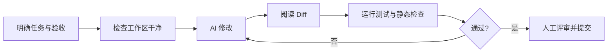

> [!summary] 一句话结论
> AI 编程工具不是只有补全代码一种形态；聊天、IDE 助手、终端 Agent 和代码审查各自适合不同任务，关键是按上下文范围和风险选择。

## 为什么重要

把所有任务都交给同一个工具，容易出现过度授权、上下文不足或效率低下。聊天工具适合讨论方案，IDE 助手适合局部修改，终端 Agent 适合跨文件执行，代码审查工具适合发现遗漏。理解它们的边界，可以减少“AI 写了但没人真正理解”的代码。

## 四类工具

| 类型 | 典型能力 | 适合任务 | 主要风险 |
| --- | --- | --- | --- |
| 聊天工具 | 解释、设计、生成片段 | 学习、方案讨论、样例代码 | 不了解真实仓库状态 |
| IDE 助手 | 补全、局部编辑、重构 | 函数级实现、测试、注释 | 上下文局限、接受错误补全 |
| 终端 Agent | 读写文件、运行命令、循环修复 | 跨文件功能、迁移、排错 | 权限过大、命令副作用 |
| 代码审查 | 阅读 Diff、提出评论 | 发现缺陷、补充测试 | 误报、遗漏业务语义 |

GitHub Copilot、Claude Code 和 Codex 等官方文档都强调：工具能力越强，越需要明确任务边界、测试和人工审查。[^1][^2][^3]

## 按任务选择

### 学习与方案讨论

使用聊天工具，先让它列出方案、权衡和未知项。不要让模型在没有代码库上下文时假装知道现有实现。

### 小范围修改

IDE 助手通常更高效。给出文件、函数、约束和测试要求，并逐段审查生成结果。

### 跨文件重构

终端 Agent 更适合，但应先在版本控制中创建干净起点，限制可访问目录，并要求每一步运行测试。禁止在没有审核的情况下执行删除、发布或数据库迁移。

### 审查与回归

让代码审查工具专门寻找边界条件、异常处理、安全问题和测试缺口。审查提示应聚焦“什么问题可能出错”，而不是只要求“评价代码”。

## 一个安全的工作流

## 常见误区

- 只看生成速度，不看返工和审查成本。
- 没有测试就让 Agent 自动修改大量文件。
- 用聊天工具生成与仓库约定不符的架构。
- 自动接受补全，却没有理解副作用。
- 把 AI 审查当作唯一质量门禁。

## 检查清单

- [ ] 工具是否能看到完成任务所需的真实上下文？
- [ ] 是否限制了文件和命令权限？
- [ ] 是否有测试、类型检查和静态检查？
- [ ] 是否逐行阅读最终 Diff？
- [ ] 是否保留人工所有权和责任？

## 相关笔记

- [[让 AI 理解代码库：上下文、检索与仓库规则]]
- [[规格驱动开发：先定义验收标准]]
- [[AI 生成代码的测试策略]]
- [[00-AI与效率知识库|知识库总览]]

## 来源

[^1]: [GitHub Copilot documentation](https://docs.github.com/en/copilot)
[^2]: [Claude Code overview](https://docs.anthropic.com/en/docs/claude-code/overview)
[^3]: [OpenAI Codex documentation](https://developers.openai.com/codex/)
[^4]: [GitHub: About code review](https://docs.github.com/en/pull-requests/collaborating-with-pull-requests/reviewing-changes-in-pull-requests/about-pull-request-reviews)
