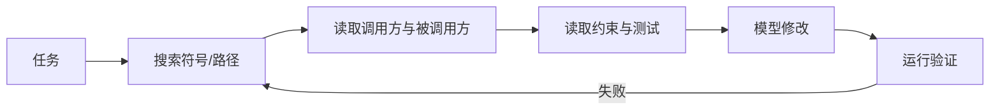

> [!summary] 一句话结论
> AI 写错代码，很多时候不是模型不会写，而是它没有看到正确的文件、约束、历史决策和验证命令。

## 为什么重要

代码库包含大量隐含知识：目录约定、错误处理方式、依赖版本、命名规则、测试命令和不可随意修改的模块。只给模型一个需求，它会用通用模式填补空白，结果可能能运行，却不符合项目维护方式。

## 模型需要哪些上下文

1. **任务上下文**：需求、验收标准、相关 Issue。
2. **代码上下文**：入口文件、调用方、数据结构、接口定义。
3. **约束上下文**：语言版本、依赖、编码规范、禁止事项。
4. **验证上下文**：测试命令、构建命令、静态检查。
5. **历史上下文**：相关提交、设计决策、已知失败案例。

## 建立仓库规则文件

在仓库根目录维护一份供 AI 阅读的规则文件，例如 `AGENTS.md`、`CLAUDE.md` 或项目自己的说明。内容应短而可执行：

```markdown
# 开发规则
- 新功能必须包含测试。
- 不允许新增运行时依赖，除非说明理由。
- API 错误统一使用 Result 类型。
- 提交前运行：npm test、npm run lint。
- 不要修改 generated/ 目录。
```

规则文件不是越长越好。稳定、具体、与验证直接相关的规则更容易被遵守。[^1]

## 检索策略

- 先按符号和调用关系定位，而不是只用向量搜索。
- 优先读取接口定义、测试和最近修改记录。
- 对大型文件先提取结构，再按需读取具体段落。
- 给每个片段保留路径、行号、版本和引用关系。
- 上下文不足时，要求 AI 明确说明还需要哪些文件。



## 控制上下文污染

不要把整个构建日志、所有依赖源码和无关文件一起塞给模型。错误信息应先提取关键堆栈、复现条件和最近变更。对检索到的第三方文档，要标记为参考资料，不让其中的指令覆盖仓库规则。

## 建立分层上下文包

可以把上下文分成三层，按任务逐步加载。第一层是仓库规则和架构入口，说明技术栈、目录职责与验证命令；第二层是目标模块的接口、调用方和测试；第三层才是具体实现文件、日志和最近提交。这样既避免一次加载过多，又能让模型知道何时需要继续读取。

对每个文件都保留稳定标识，例如相对路径、符号名和提交 SHA。模型提出的修改若引用不存在的路径或行号，应视为上下文错误而不是直接接受。任务结束后，把仍然有效的架构决策写回仓库文档，让下一次 AI 会话不必重新发现。

## 常见误区

- 只给需求，不给入口文件和调用关系。
- 规则文件写满泛泛原则，没有可执行命令。
- 检索只看文本相似度，不检查符号和版本。
- 上下文过长导致真正关键约束被淹没。
- 模型说“已完成”却不运行项目测试。

## 检查清单

- [ ] 是否提供需求、入口和调用方？
- [ ] 是否说明版本与依赖约束？
- [ ] 是否给出准确验证命令？
- [ ] 是否使用符号检索和最近变更？
- [ ] 是否要求模型报告不确定信息？

## 相关笔记

- [[AI 编程工具全景：聊天、IDE、终端与代码审查]]
- [[规格驱动开发：先定义验收标准]]
- [[从提示工程到上下文工程]]
- [[00-AI与效率知识库|知识库总览]]

## 来源

[^1]: [AGENTS.md: A simple, open format for guiding coding agents](https://agents.md/)
[^2]: [GitHub: About code search](https://docs.github.com/en/search-github/searching-on-github/searching-code)
[^3]: [GitHub Copilot: Best practices](https://docs.github.com/en/copilot/using-github-copilot/best-practices-for-using-github-copilot)
[^4]: [Anthropic: Claude Code best practices](https://www.anthropic.com/engineering/claude-code-best-practices)
