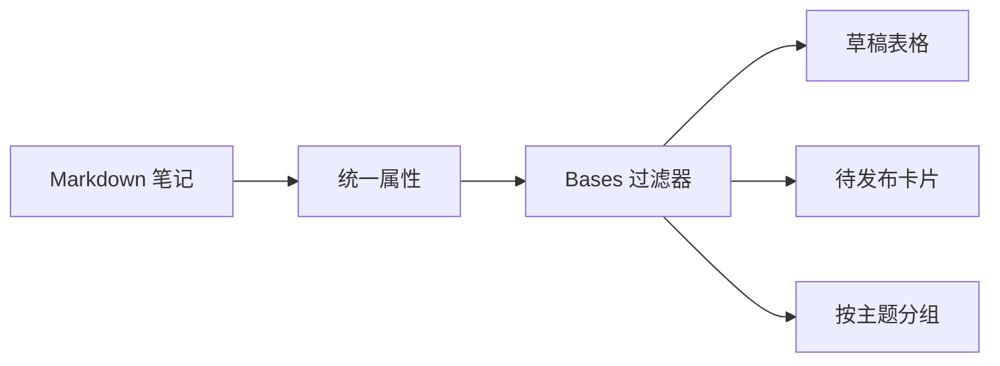

> [!summary] 一句话结论
> Bases 把带属性的 Markdown 笔记变成可筛选、排序和切换视图的数据库，同时不改变笔记仍是普通文件的事实。

## 为什么重要

当笔记数量增加时，手动维护索引会很累。Bases 可以基于属性显示同一批笔记的表格、卡片或其他视图，适合管理阅读清单、项目任务、来源库和内容状态。[^1]

## 先准备结构化属性

Bases 的价值取决于属性质量。建议至少统一以下字段：

```yaml
status: draft
level: 入门
tags:
  - AI
created: 2026-09-18
due: 2026-10-01
source_type: official
```

如果同一字段有时是文本、有时是日期，筛选和排序就会失效。先定义字段类型，再批量维护。

## 一个内容管理示例



常用视图包括：

- **全部内容**：显示标题、状态、更新时间和标签。
- **待发布**：过滤 `status = draft`，按更新时间排序。
- **官方来源**：过滤 `source_type = official`。
- **学习路线**：按 `level` 分组，显示阅读顺序。
- **到期任务**：过滤 `due`，显示逾期和未来七天。

## 建立步骤

1. 选择一组属性一致的笔记。
2. 创建 `.base` 文件并设置数据源。
3. 只显示必要列，减少界面噪声。
4. 增加筛选条件，例如状态、标签和日期。
5. 保存多个视图，分别服务不同工作流。
6. 定期检查空值、格式错误和重复笔记。

## 设计原则

- 先有稳定的数据字段，再创建视图。
- 一个视图只回答一个问题。
- 对日期、状态等字段使用一致格式。
- 保留原始笔记链接，避免只在表格中工作。
- 对自动生成视图不手工排序，优先用字段排序。

## 从简单表格开始

第一版 Base 只需四列：标题、状态、更新时间和标签。先确认每篇笔记都有 `status`，再增加 `level` 与 `source_type`。当筛选规则稳定后，可以创建“待核验来源”视图：过滤 `source_type = official` 且 `status = draft`，按 `updated` 升序排列，让最久未处理的笔记排在前面。

如果 Bases 中出现大量空白字段，不要立刻补默认值，应先检查属性是否存在拼写差异。日期字段应使用 `YYYY-MM-DD`，状态字段应使用固定英文或中文枚举。视图本身只是查询结果，质量仍来自笔记结构和持续维护。

## 常见误区

- 把 Bases 当作传统数据库，塞入大量无关字段。
- 属性命名不统一，导致筛选遗漏。
- 创建太多视图，没有明确使用场景。
- 只维护表格，不写正文解释。
- 忽略移动端和不同 Obsidian 版本的显示差异。

## 检查清单

- [ ] 笔记属性类型是否统一？
- [ ] 每个视图是否对应一个真实问题？
- [ ] 是否保留标题和原文链接？
- [ ] 是否能快速发现空值和过期项？
- [ ] 是否定期检查 Bases 与手动索引的一致性？

## 相关笔记

- [[标签、属性与文件夹：建立可维护的知识结构]]
- [[构建知识库首页：MOC 与主题导航]]
- [[Obsidian 入门：Vault、双向链接与 Markdown]]
- [[00-AI与效率知识库|知识库总览]]

## 来源

[^1]: [Obsidian Help: Bases](https://help.obsidian.md/bases)
[^2]: [Obsidian Help: Properties](https://help.obsidian.md/properties)
[^3]: [Obsidian Help: Search](https://help.obsidian.md/plugins/search)
[^4]: [Obsidian Help: Views](https://help.obsidian.md/views)
