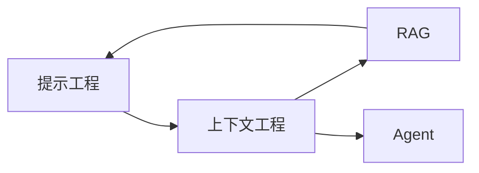

> [!summary] 一句话结论
> Obsidian 的核心是本地 Markdown 文件和双向链接：文件始终属于你，笔记之间通过链接逐渐形成知识网络。

## 为什么重要

许多笔记软件把内容保存在专有云数据库中，导出和迁移成本较高。Obsidian Vault 本质上是一个本地文件夹，笔记是普通 Markdown 文本，图片和附件也保存在本地。这使备份、版本控制和跨工具迁移更容易。

## 三个核心概念

### Vault

Vault 是一个存放笔记、附件和配置的文件夹。你可以为工作、学习或个人项目建立不同 Vault，也可以用一个 Vault 配合属性和标签区分内容。Vault 越大，越需要稳定命名和检索规则。

### Markdown

Markdown 使用简单符号表达标题、列表、链接、引用和代码。Obsidian 增加了 Wiki 链接、嵌入、Callout、属性等扩展，但文件仍可被其他 Markdown 编辑器读取。

### 双向链接

输入 `[[笔记名称]]` 可以链接另一篇笔记。被链接笔记会自动显示反向链接，帮助你发现知识之间的关系。[^1]

## 推荐入门步骤

1. 建立 Vault 和合理的顶层文件夹。
2. 先写 10–20 篇真实笔记，不急着搭复杂系统。
3. 每篇笔记只围绕一个主题，标题表达清楚观点。
4. 用链接连接相关概念，不要只依赖文件夹。
5. 给关键笔记添加属性和标签。
6. 设置 Git 或可靠备份，并定期验证恢复流程。

## 文件夹、链接和标签怎么选

- **文件夹**：表达稳定的大类，例如 `项目`、`知识库`、`归档`。
- **链接**：表达具体关系，例如“这篇笔记依赖哪篇”。
- **标签**：表达跨目录状态，例如 `待整理`、`已核验`、`AI`。
- **属性**：表达可筛选字段，例如状态、作者、日期、来源。

不要同时用文件夹、标签和属性表达同一件事，否则维护成本会快速上升。

## 一周上手练习

第一天创建一个 Vault，写一篇“我为什么要建立知识库”。第二天练习标题、列表和代码块。第三天为笔记添加 `tags` 与 `status` 属性。第四天把两篇相关笔记用链接连接起来。第五天建立一篇 MOC，把已有内容按阅读顺序排列。第六天使用搜索和反向链接找到遗漏关系。第七天执行一次完整备份，并尝试从备份打开 Vault。

这个练习不追求数量，而是让你同时体验输入、结构化、连接和恢复四个环节。只有恢复流程也验证通过，备份才算真正可靠。

## 常见误区

- 一开始就安装大量插件和复杂模板。
- 复制别人的目录，却不理解自己的检索场景。
- 只收藏不加工，形成“数字垃圾场”。
- 认为双链会自动产生知识，却不写解释和上下文。
- 没有备份，误删后无法恢复。

## 检查清单

- [ ] 每篇笔记是否有清晰单一主题？
- [ ] 是否链接到相关笔记，而不是孤立存放？
- [ ] 是否只使用必要的标签与属性？
- [ ] 是否有稳定备份与恢复演练？
- [ ] 是否能用自己的话解释笔记内容？

## 相关笔记

- [[构建知识库首页：MOC 与主题导航]]
- [[标签、属性与文件夹：建立可维护的知识结构]]
- [[用 Git 同步 Obsidian：备份、冲突与安全]]
- [[00-AI与效率知识库|知识库总览]]

## 来源

[^1]: [Obsidian Help: Links](https://help.obsidian.md/links)
[^2]: [Obsidian Help: Create your first note](https://help.obsidian.md/getting-started/create-your-first-note)
[^3]: [Obsidian Help: Properties](https://help.obsidian.md/properties)
[^4]: [Markdown Guide: Basic syntax](https://www.markdownguide.org/basic-syntax/)
