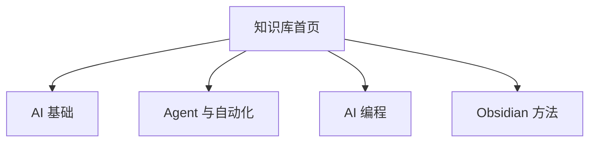

> [!summary] 一句话结论
> MOC（Map of Content）不是目录的复制品，而是围绕一个主题组织关键问题、核心笔记和学习路径的导航页。

## 为什么重要

当笔记数量增加后，搜索只能解决“知道关键词”的问题，却无法告诉你从哪里开始、哪些内容最重要、下一步该学什么。MOC 为知识库提供入口和路线，让信息从列表变成可探索的理解路径。

## 一个好 MOC 包含什么

- 主题目标和适用人群；
- 3–7 个核心问题；
- 按学习顺序排列的关键笔记；
- 重要概念的解释，而不只是一串链接；
- 不同角色的阅读路线；
- 待补充、待验证和更新日期。

## 推荐结构

```markdown
# 主题名称

> 用 2–3 句说明这个主题解决什么问题。

## 快速开始
- [[第一篇入门笔记]]
- [[关键术语表]]

## 核心路径
1. [[基础概念]]
2. [[实践方法]]
3. [[案例与工具]]

## 深入主题
- [[进阶笔记 A]]
- [[进阶笔记 B]]

## 状态
- 最后核验：YYYY-MM-DD
- 待补充：...
```

## 如何维护 MOC

### 从问题出发

不要按文件夹机械复制链接。先写出读者最常问的 5 个问题，再把能回答问题的笔记放到对应位置。

### 控制层级

总览页只负责导航，不展开所有细节。每个主主题可以有子 MOC，但链接层级过深会让人失去方向。

### 保留解释

两个链接之间写一句为什么推荐阅读，能显著提高导航价值。例如：“先理解上下文工程，再看 RAG，因为后者是前者的一个具体实现。”



## 从问题到导航的示例

假设你在学习 AI，读者可能问：“我需要先懂数学吗？”“怎样让模型使用我的资料？”“如何避免 AI 写错代码？”“笔记越来越多怎么办？”这些问题可以分别导向基础、RAG、AI 编程和知识管理四组笔记。

首页不只是把四组链接列出来，还要写出推荐顺序和判断标准。例如先读“模型如何工作”和“提示工程”，再进入“上下文工程”；只有需要私有资料时，再阅读 RAG。这样读者能根据目标选择路线，而不是从头到尾机械浏览。每季度检查一次链接、阅读顺序和过时内容，并记录本次维护修改了什么。

## 常见误区

- MOC 只是目录截图或文件夹链接。
- 把所有笔记都塞进一个首页。
- 链接从不更新，内容早已迁移。
- 没有阅读顺序，初学者不知道从哪里开始。
- 只收集资源，不记录自己的理解和判断。

## 检查清单

- [ ] 首页是否说明主题和适用对象？
- [ ] 是否提供明确阅读路径？
- [ ] 链接之间是否有解释？
- [ ] 是否有最后更新日期和维护者？
- [ ] 能否在 30 秒内找到关键内容？

## 相关笔记

- [[Obsidian 入门：Vault、双向链接与 Markdown]]
- [[标签、属性与文件夹：建立可维护的知识结构]]
- [[Obsidian Bases 入门：用数据库视图管理笔记]]
- [[00-AI与效率知识库|知识库总览]]

## 来源

[^1]: [Obsidian Help: Links](https://help.obsidian.md/links)
[^2]: [Nick Milo: Maps of Content](https://notes.linkingyourthinking.com/Atlas/Maps+of+Content)
[^3]: [Andy Matuschak: Evergreen notes](https://notes.andymatuschak.org/Evergreen_notes)
[^4]: [Obsidian Help: Books and long-form writing](https://help.obsidian.md/guides/books-and-long-form-writing)
