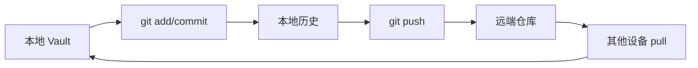

> [!summary] 一句话结论
> Git 适合为 Obsidian 提供版本历史、离线备份和多设备同步，但它不是实时协作工具，冲突处理和凭据安全必须提前设计。

## 为什么重要

Git 会保存每次提交的历史，因此可以查看修改、比较版本并恢复到过去状态。相比单一云盘同步，它更适合文本知识库。但 Git 也有学习成本，自动提交过于频繁会产生大量噪声，处理不当还会泄露敏感笔记或凭据。

## 工作原理



Obsidian Git 插件可以在 Obsidian 内提交、拉取和推送，并支持定时自动同步。[^1]

## 最小安全配置

### 只同步需要的内容

在 `.gitignore` 中排除设备状态和缓存：

```gitignore
.obsidian/workspace.json
.obsidian/workspace-mobile.json
.obsidian/cache/
.trash/
```

如果仓库公开，任何提交过的敏感信息都应视为已经泄露，删除最新文件并不能清除历史。

### 使用凭据管理器

不要把 Personal Access Token 写进 URL、脚本或笔记。使用 Git Credential Manager、SSH Key 或系统密钥存储。PAT 应设置最小权限和过期时间。[^2]

### 控制自动同步频率

自动同步应避免每次击键都提交。推荐按固定间隔检查变化，提交信息包含日期；大量编辑完成后再手动同步也很合理。

## 处理冲突

冲突常见于两个设备同时修改同一文件。处理步骤：

1. 停止自动提交，避免继续扩大冲突。
2. 运行 `git status` 查看冲突文件。
3. 打开冲突标记，理解两边修改，而不是机械选择一边。
4. 修改后运行 Markdown 链接检查和必要测试。
5. `git add`、`git commit`、`git push`。
6. 其他设备先拉取再继续编辑。

## 备份恢复演练

仅仅成功推送不代表备份可靠。应定期在新目录克隆仓库，确认笔记、附件和配置可以打开。重要资料还应保留独立备份，避免远端账号、网络或凭据故障造成单点风险。

## 提交粒度与远端选择

提交信息应描述一个完整变化，例如“新增 AI 提示工程笔记”或“修正三条失效链接”。如果一次提交同时包含整理目录、批量改名和内容修改，后期回滚会非常困难。批量改名时先单独提交移动结果，再提交内容修改，可以让 Git 准确识别历史。

远端可以选择私有 GitHub、Gitee 或自建 Git 服务。公开仓库适合分享非敏感知识，私人日记、客户资料和密钥应使用私有仓库或完全不进入 Git。无论选择哪个远端，都应启用双因素认证、限制推送权限并定期检查仓库可见性。

## 常见误区

- 在公开仓库同步私人日记和密钥。
- 多个设备同时修改同一笔记，没有拉取。
- 每次自动保存都生成提交。
- 只在本地提交，没有推送。
- 认为 Git 历史会自动包含未跟踪附件。

## 检查清单

- [ ] 敏感文件是否被忽略且从未提交？
- [ ] 凭据是否存储在安全位置？
- [ ] 是否定期拉取并处理冲突？
- [ ] 是否有可验证的恢复流程？
- [ ] 远端仓库权限是否符合最小化原则？

## 相关笔记

- [[Obsidian 入门：Vault、双向链接与 Markdown]]
- [[AI 隐私与数据边界：哪些内容不要上传]]
- [[构建知识库首页：MOC 与主题导航]]
- [[00-AI与效率知识库|知识库总览]]

## 来源

[^1]: [Obsidian Git documentation](https://publish.obsidian.md/git-doc)
[^2]: [Git: Credential Storage](https://git-scm.com/book/en/v2/Git-Tools-Credential-Storage)
[^3]: [GitHub: Managing personal access tokens](https://docs.github.com/en/authentication/keeping-your-account-and-data-secure/managing-your-personal-access-tokens)
[^4]: [Pro Git Book](https://git-scm.com/book/en/v2)
