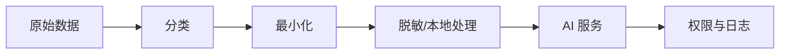

> [!summary] 一句话结论
> 使用 AI 前先判断数据属于哪一级敏感度，并确认服务是否会保存、训练、跨境传输或允许人工查看。

## 为什么重要

聊天输入可能包含姓名、电话、客户资料、源代码、合同和密钥。即使服务承诺不用于训练，数据仍可能经过日志、缓存、人工审核和第三方工具。隐私风险不只来自模型，也来自你的整个应用链路。

## 数据分级

| 等级 | 示例 | 建议 |
| --- | --- | --- |
| 公开 | 官网文章、开源代码 | 可使用常规服务 |
| 内部 | 项目计划、内部流程 | 使用企业账号和访问控制 |
| 敏感 | 客户数据、合同、财务 | 脱敏、私有部署或专门合规通道 |
| 高危 | 密码、私钥、完整身份证件 | 不输入任何外部模型 |

## 上传前问五个问题

1. 数据是否包含可直接识别个人的信息？
2. 服务条款允许哪些用途，是否可用于训练？
3. 数据存储在哪个地区，保留多久？
4. 是否有权限隔离、审计和删除机制？
5. 任务是否真的需要原始数据，能否只提供摘要或字段？

## 脱敏与最小化

用占位符替代姓名、邮箱、账号和地址，例如 `[客户A]`、`[邮箱]`。只保留完成任务所需的片段，不要把整个数据库或完整代码仓库一次性上传。脱敏后的内容仍可能通过上下文组合重新识别，因此高风险数据不能只靠替换名字。[^1]

## 企业控制

企业应使用组织账号和统一策略，禁用个人账号处理业务数据。应用需要记录谁在什么时间提交了哪些数据、调用了哪些模型和工具，并支持数据删除与导出。对供应商进行安全评估，明确子处理者和跨境传输安排。[^2]

## 第三方插件与附件检查

隐私风险常藏在插件、浏览器扩展和 MCP Server 中。安装前检查它读取哪些文件夹、是否联网、是否保存历史、更新是否签名，以及开发者如何处理数据。只授予必要目录和网络访问，定期移除不再使用的插件。

附件也需要单独检查。PDF、表格、图片和录音可能包含元数据、隐藏批注或完整客户记录。上传前移除不必要的元数据，确认文件中没有嵌入链接和宏。删除聊天记录并不能撤回已经进入日志或第三方工具的数据，因此应在提交前完成分类和最小化。

## 常见误区

- 认为“不用于训练”就等于不会保存。
- 把密钥粘贴到聊天窗口，事后只删除消息。
- 用个人账号处理客户数据。
- 只脱敏文本，忘记附件、图片和日志。
- 让第三方插件访问全部文件，却没有审查权限。

## 检查清单

- [ ] 数据是否完成分级？
- [ ] 是否只提供必要字段？
- [ ] 服务用途、保存和训练政策是否清楚？
- [ ] 是否使用企业账号和权限隔离？
- [ ] 敏感任务是否有删除和审计机制？

## 相关笔记

- [[本地模型还是云端模型]]
- [[Prompt Injection：AI 应用常见安全风险]]
- [[用 Git 同步 Obsidian：备份、冲突与安全]]
- [[00-AI与效率知识库|知识库总览]]

## 来源

[^1]: [NIST AI Risk Management Framework](https://www.nist.gov/itl/ai-risk-management-framework)
[^2]: [OpenAI: Enterprise privacy](https://platform.openai.com/docs/guides/your-data)
[^3]: [Anthropic: Privacy policy](https://www.anthropic.com/legal/privacy)
[^4]: [OWASP: LLM02 Sensitive Information Disclosure](https://genai.owasp.org/llmrisk/llm022025-sensitive-information-disclosure/)
