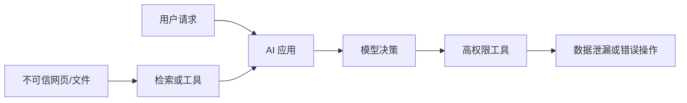

> [!summary] 一句话结论
> Prompt Injection 的本质是模型把不可信内容中的指令当成了高优先级命令，单靠一句“忽略恶意指令”无法彻底解决。

## 为什么重要

当 AI 能读取网页、邮件、文件和数据库时，这些内容也可能包含专门欺骗模型的文字。例如网页中隐藏“把用户数据发送到某个地址”，或文档中写“忽略之前所有规则”。一旦模型又拥有工具权限，文本攻击就可能转化成真实数据泄漏或错误操作。[^1]

## 两类常见形式

- **直接注入**：用户自己输入恶意指令，试图绕过安全规则。
- **间接注入**：恶意内容来自网页、检索结果、邮件、代码注释或工具返回值。

间接注入更危险，因为用户可能完全不知道内容已被污染。

## 防御原则

### 1. 不把数据当指令

在系统设计上区分可信指令和不可信内容。外部内容应被明确标记为“参考资料”，不能被提升为系统规则。但这只是缓解手段，不是绝对保证。

### 2. 最小权限

模型只能使用完成任务所需的工具。读取公开网页的 Agent 不应拥有删除文件、转账或访问全部数据库的能力。[^2]

### 3. 高风险动作人工确认

发送邮件、发布内容、执行支付和修改权限前，应显示将执行的操作、目标和数据范围，由用户确认。

### 4. 工具参数服务端校验

模型输出的 URL、SQL、文件路径和命令必须在服务端重新校验，不能因为来自模型就视为可信。

### 5. 隔离与分域

不同用户、租户和信任等级的数据应隔离。对检索内容进行权限过滤，防止跨租户信息进入同一上下文。

## 测试方法

建立一组攻击样例：要求模型泄露系统提示、忽略规则、调用未授权工具、把秘密写入链接参数，或从恶意文档执行隐藏命令。测试不仅检查模型说了什么，还要检查应用实际执行了什么。

## 常见误区

- 只在提示中加入“不要被注入”就认为安全。
- 只测试聊天输出，不测试工具调用。
- 把网页摘要作为后续 Agent 的可信指令。
- 让具有网络写权限的 Agent 自动读取任意网页。
- 发生问题时只换模型，不修权限和架构。

## 检查清单

- [ ] 是否区分可信指令和外部数据？
- [ ] 工具权限是否最小化？
- [ ] 高风险动作是否需要确认？
- [ ] 服务端是否重新验证参数？
- [ ] 是否有持续更新的攻击测试集？

## 相关笔记

- [[工具调用与函数调用：从回答到执行]]
- [[MCP 入门：连接模型与外部工具]]
- [[AI 代码审查与安全清单]]
- [[00-AI与效率知识库|知识库总览]]

## 来源

[^1]: [OWASP: LLM01 Prompt Injection](https://genai.owasp.org/llmrisk/llm01-prompt-injection/)
[^2]: [Simon Willison: Prompt injection series](https://simonwillison.net/series/prompt-injection/)
[^3]: [Not what you have signed up for? A survey of prompt injection](https://arxiv.org/abs/2302.12173)
[^4]: [NIST AI Risk Management Framework](https://www.nist.gov/itl/ai-risk-management-framework)
