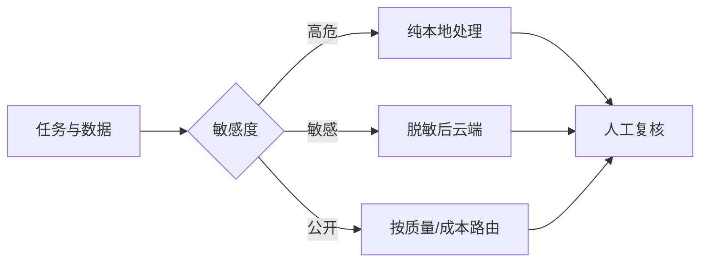

> [!summary] 一句话结论
> 本地模型换来隐私和可控性，云端模型提供更强能力与弹性；最佳方案往往不是二选一，而是按数据敏感度和任务难度路由。

## 为什么重要

企业希望保护数据，个人希望减少订阅成本，开发者希望避免网络波动。但本地模型需要显存、内存和维护，能力也可能落后于云端。先明确数据边界和任务要求，再决定模型放在哪里。

## 核心差异

| 维度 | 本地模型 | 云端模型 |
| --- | --- | --- |
| 隐私 | 数据默认留在本机 | 依赖服务条款与隔离 |
| 能力 | 受硬件和模型规格限制 | 通常可使用更大模型 |
| 成本 | 前期硬件成本高，边际调用低 | 按 Token 或订阅计费 |
| 延迟 | 无网络往返，可能稳定 | 受网络和排队影响 |
| 维护 | 自行更新、量化和排障 | 厂商维护和升级 |
| 可用性 | 离线可用 | 依赖网络与服务状态 |

Ollama、LM Studio 等工具降低了本地运行模型的门槛，但硬件兼容、量化精度和上下文长度仍然影响效果。[^1][^2]

## 推荐架构

### 适合本地

- 数据不能离开设备；
- 任务固定且对模型能力要求较低；
- 需要离线、低延迟或高频调用；
- 可以通过小模型完成分类、摘要和字段抽取。

### 适合云端

- 复杂推理、多模态和长上下文；
- 需要快速接入最新能力；
- 流量波动大，不想维护硬件；
- 数据已脱敏且服务满足合规要求。

## 混合方案

可以先在本地做敏感信息识别、脱敏和路由，只把允许外发的内容交给云端。也可以让本地小模型处理 80% 的简单请求，复杂请求升级到云端。路由规则必须可审计，不能让模型自行决定敏感数据是否能出网。

## 本地部署检查

1. 估算模型权重、KV Cache 和上下文所需内存。
2. 验证目标量化版本在真实任务上的质量。
3. 限制服务暴露范围，不要默认监听所有网卡。
4. 记录模型、上下文和提示版本。
5. 建立离线更新和磁盘备份策略。

## 常见误区

- 认为本地部署自动合规，却忽略日志和终端安全。
- 只比较参数量，不比较量化后的实际质量。
- 低估模型文件、缓存和上下文占用的内存。
- 把敏感数据脱敏后仍附上原始附件。
- 没有为网络失败准备降级路径。

## 检查清单

- [ ] 数据是否允许离开设备？
- [ ] 本地硬件是否能满足上下文与并发？
- [ ] 云端服务是否符合保存和训练政策？
- [ ] 路由规则是否可审计？
- [ ] 是否有断网和模型故障降级方案？

## 相关笔记

- [[AI 隐私与数据边界：哪些内容不要上传]]
- [[如何选择 AI 模型：能力、成本、速度与隐私]]
- [[如何评估 AI 输出质量]]
- [[00-AI与效率知识库|知识库总览]]

## 来源

[^1]: [Ollama documentation](https://docs.ollama.com/)
[^2]: [LM Studio documentation](https://lmstudio.ai/docs)
[^3]: [Hugging Face Transformers documentation](https://huggingface.co/docs/transformers/main/en/installation)
[^4]: [OpenAI: Enterprise privacy](https://platform.openai.com/docs/guides/your-data)
